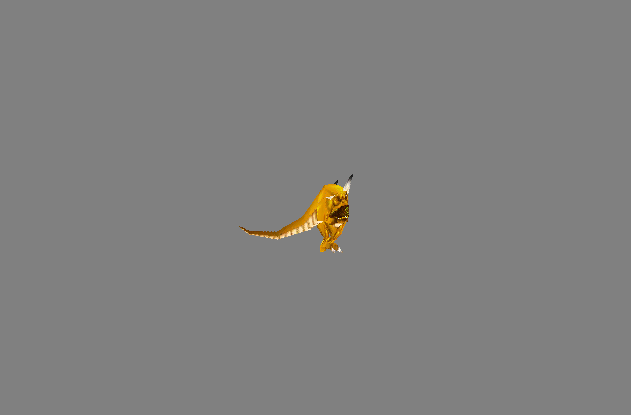
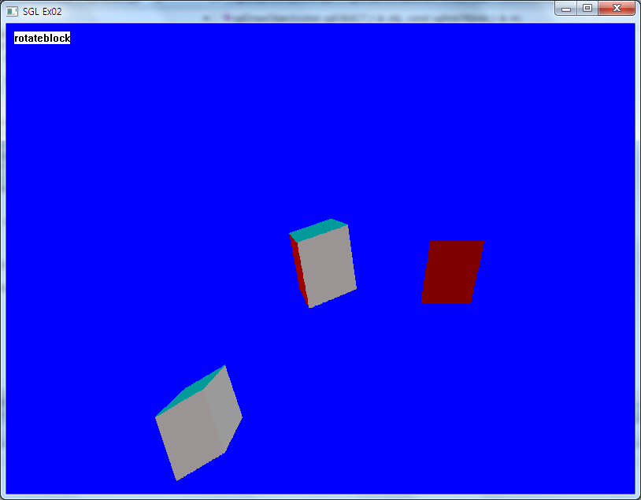
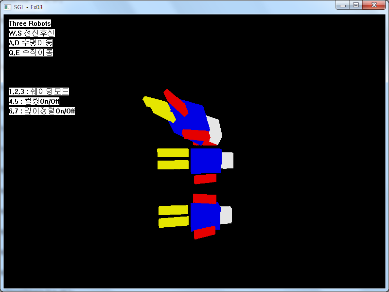
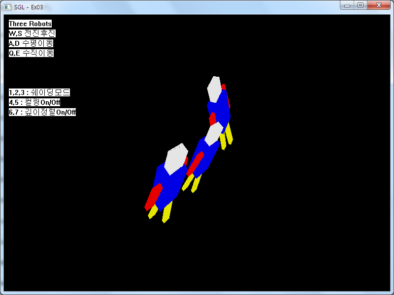
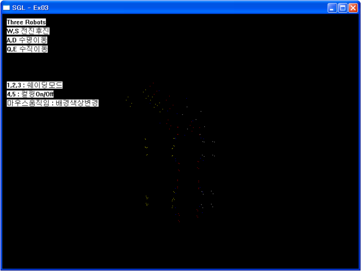
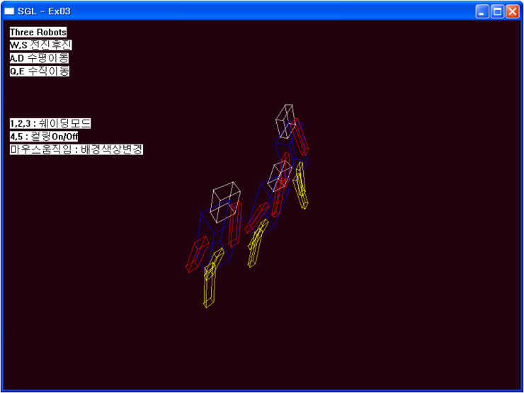
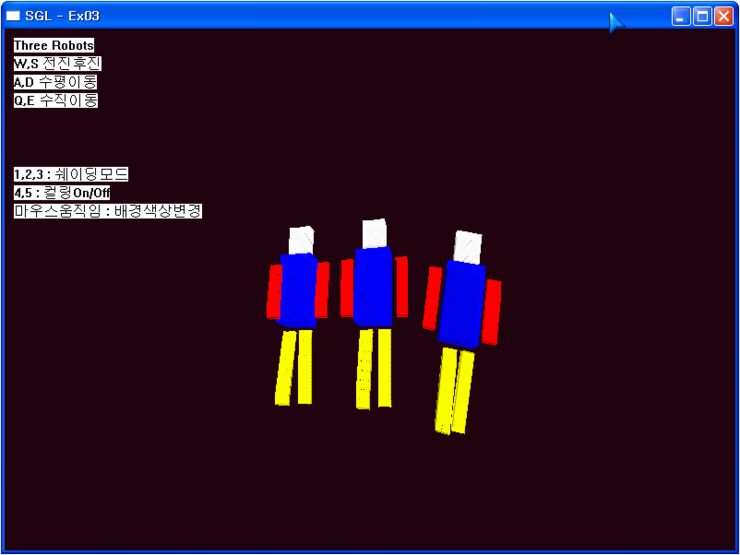
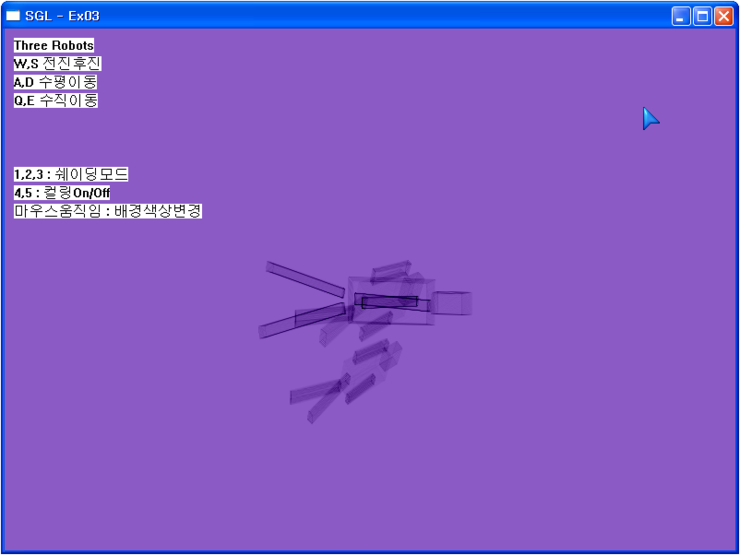
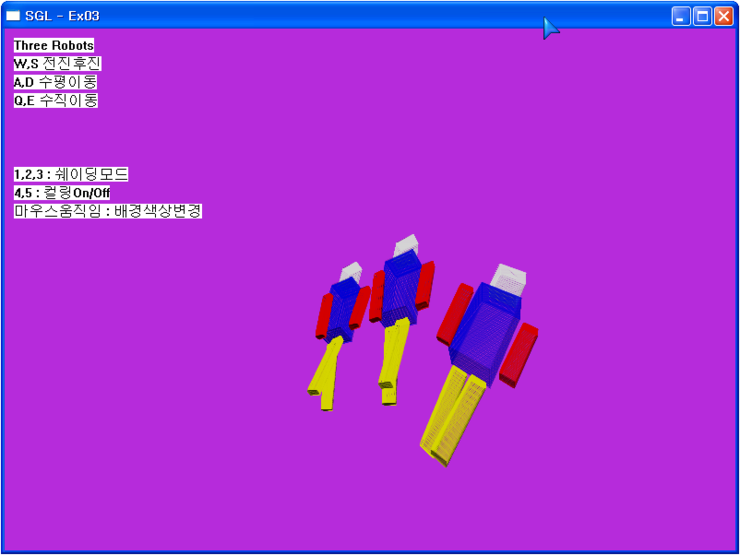
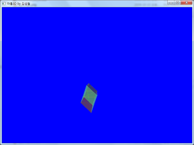

# SGL

> `알림` 이 글은 제 [네이버 블로그](http://blog.naver.com/softdna) 에서 아카이빙을 위해 가져온 글입니다. 그 당시 svn 이나 git 같은 소스 관리툴을 사용하지 않아서 코드 히스토리를 남기지 못한게 아쉽네요.

소프트웨어렌더러를 만들어 보자고 생각한 건 1년 전 쯤이었습니다. 게임 엔진 개발자를 꿈꾸는 저에게 소프트웨어 렌더러는 반드시 넘어야 할 첫 관문이라고 여겼기 때문이죠. 1년여의 시간동안 시간날 때마다 틈틈히 만들어 온 것이 구현하고자 했던 목표를 다 구현하게 되었습니다. 1년동안 프로젝트를 하면서 많은 정이 든 프로젝트이고 (도대체 갈아 엎기를 몇 번 ? ㅋㅋㅋ) 저에게 많은 도움을 준 프로젝트입니다. 특히 최적화 부분에 대해서 많은 것을 생각하게 해준 프로젝트였고 최적화라는 것이 얼마나 힘든 것인지 느꼈답니다... 아직도 많이 부족하지만 3D 그래픽스의 기초 원리를 배운 것에 만족하고 물리엔진, 캐릭터엔진, 지형엔진 개발로 발을 옮기려고 합니다. :)

구현사항은 아래와 같습니다.

 1. 깊이정렬
 2. 클리핑 ( 오브젝트, 뷰잉공간, 이미지공간 )
 3. 텍스춰매핑
 4. 흉내만 낸 고러드 쉐이딩
 5. ambient 및 diffuse 라이팅 구현
 6. obj 모델 파일 렌더링
 7. md2 모델 파일 렌더링
 
총 4번의 업그레이드를 지나오면서 위의 목표한 바를 구현하였습니다. `주의` 영상 소리 있음 
 
<iframe width="640" height="480" src="http://www.youtube.com/embed/wUCMvPbU6Ag" frameborder="0"></iframe>

SGL의 히스토리
 
### SGL4

 1. 좀 더 빠른 렌더링을 위해 DIBSECTION 대신 SDL 의 하드웨어 서피스를 사용.
 2. 좀 더 세분화된 클리핑을 지원
 3. 텍스춰 매핑 지원
 4. 라이팅을 더 정확하게 구현

### SGL3

 1. 깊이정렬 구현
 2. 벡페이스컬링 구현

### SGL2
 
 1. OpenGL 의 인터페이스 흉내
 2. 삼각형으로 오브젝트 정의
 3. 플랫쉐이딩
 4. 카메라무브
 5. 단순한 라이팅
 6. 단순한 클리핑( 이미지 공간 ) 등등 기본 적인 것들

 
### SGL1

 1. 소프트웨러렌더러를 처음 만들겠다고 마음 먹고 구현 했던 초 간단 버전
 2. 첫 이름은 아톰3D 였어요. 3D 의 기본 Atom 이라고 생각해서 지은 이름이었답니다. 

 

---

SGL is a software 3D rendering engine written by c++. It's similar to the OpenGL. 
SGL supports texture mapping, md2 model rendering and others. 
 
You can preview SGL's running demo video on youtube.
  
<iframe width="640" height="480" src="http://www.youtube.com/embed/wUCMvPbU6Ag" frameborder="0"></iframe>